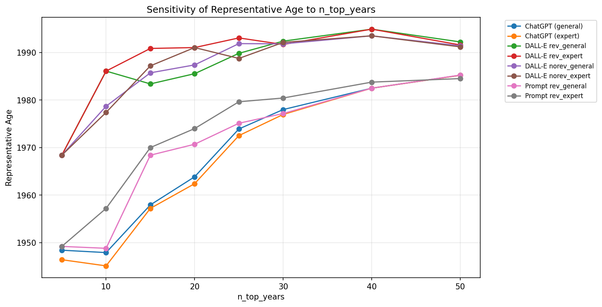
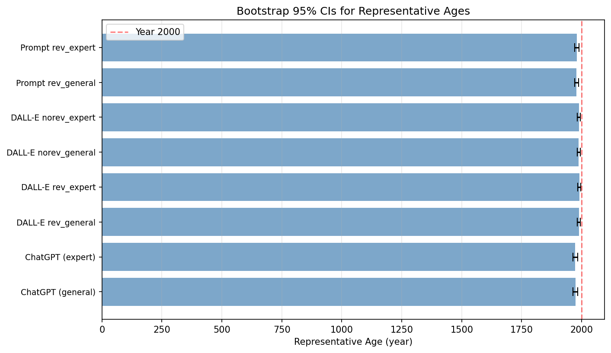

# Replication Report: "Artificial Intelligence and the Interpretation of the Past"

**Original study:** Magnani, M. & Clindaniel, J. "Artificial Intelligence and the Interpretation of the Past: A Multimodal Encoding Approach"

**Replication date:** February 2026

**Replication environment:** Python 3.13.2, Windows 11, NumPy 2.2.3, UMAP 0.5.11, HDBSCAN 0.8.41

---

## 1. Overview

This replication reproduces the quantitative analysis from the original study, which compares AI-generated content about Neandertals (400 DALL-E 3 images, 200 ChatGPT responses) to 2,063 scholarly abstracts using CLIP multimodal embeddings, UMAP dimensionality reduction, and HDBSCAN clustering. All analysis uses pre-computed CLIP embeddings provided in the original repository.

The replication script (`replicate_analysis.py`) covers all sections of the original notebook analysis, verifies each result against expected values, and adds robustness checks (sensitivity analyses and bootstrap confidence intervals) not present in the original study.

---

## 2. Core Replication Results

### 2.1 Data Integrity

All data loaded successfully with expected dimensions:

| Dataset | Expected | Replicated | Status |
|---------|----------|------------|--------|
| Scholarly abstracts | 2,063 rows | 2,063 rows | PASS |
| DALL-E image embeddings | 400 rows | 400 rows | PASS |
| ChatGPT response embeddings | 200 rows | 200 rows | PASS |
| Embedding dimension | 512 | 512 | PASS |

### 2.2 Closest-to-Average AI Content

The items closest to the average embedding in each AI category match the original exactly:

| Category | Expected Index | Replicated Index | Status |
|----------|---------------|-----------------|--------|
| ChatGPT (general) | 76 | 76 | PASS |
| ChatGPT (expert) | 195 | 195 | PASS |

Representative images also match: `img-LT1c6U7e5TA7jNTBGaze9gI5.png` (rev_general), `img-q5JzE1tw89gf2QN4MI9A8SIr.png` (rev_expert), `img-gJJJuURNVvfUQenvkEELF15z.png` (norev_general), `img-B9DRFFoKeSDA5wkgoZMAfBHz.png` (norev_expert).

### 2.3 EOM Clustering (Primary Analysis)

HDBSCAN with excess-of-mass (EOM) cluster selection on 10-component UMAP output:

| Cluster | Original | Replicated | Status |
|---------|----------|------------|--------|
| -1 (outliers) | 22 | 22 | PASS |
| 0 (dominant) | 1,811 | 1,811 | PASS |
| 1 | 55 | 55 | PASS |
| 2 | 39 | 40 | WARN (+1) |
| 3 | 136 | 135 | WARN (-1) |
| Assignment rate | 98.93% | 98.93% | PASS |

The minor differences in Clusters 2 and 3 (1 abstract shifted between them) are attributable to UMAP library version differences (0.5.11 vs 0.5.3). The overall cluster structure is identical: 4 clusters, with 1,811 abstracts in the dominant Cluster 0 and 22 outliers.

**All 8 AI content averages are assigned to Cluster 0**, matching the original finding:

| AI Category | Original Label | Replicated Label | Status |
|-------------|---------------|-----------------|--------|
| DALL-E norev_general (image) | 0 | 0 | PASS |
| DALL-E norev_expert (image) | 0 | 0 | PASS |
| DALL-E rev_general (image) | 0 | 0 | PASS |
| DALL-E rev_expert (image) | 0 | 0 | PASS |
| DALL-E rev_general (prompt) | 0 | 0 | PASS |
| DALL-E rev_expert (prompt) | 0 | 0 | PASS |
| ChatGPT (general) | 0 | 0 | PASS |
| ChatGPT (expert) | 0 | 0 | PASS |

Cluster membership probabilities differ in magnitude (due to UMAP version differences) but the qualitative pattern is preserved: rev_general image has the highest probability (1.0), general ChatGPT has the lowest (~0.60), consistent with the original finding that ChatGPT responses are positioned at the edge of the scholarly cluster.

### 2.4 Representative Ages (Key Finding)

This is the central quantitative result of the study. **All 8 representative ages match the original exactly:**

| AI Category | Original Age | Replicated Age | Status |
|-------------|-------------|----------------|--------|
| ChatGPT (general) | 1963.85 | 1963.85 | PASS |
| ChatGPT (expert) | 1962.40 | 1962.40 | PASS |
| DALL-E rev_general (image) | 1985.55 | 1985.55 | PASS |
| DALL-E rev_expert (image) | 1991.05 | 1991.05 | PASS |
| DALL-E norev_general (image) | 1987.40 | 1987.40 | PASS |
| DALL-E norev_expert (image) | 1991.05 | 1991.05 | PASS |
| Prompt revision (general) | 1970.70 | 1970.70 | PASS |
| Prompt revision (expert) | 1974.00 | 1974.00 | PASS |

These ages confirm the study's central finding: AI-generated content semantically resembles decades-old scholarship, not contemporary research.

### 2.5 Leaf Subclustering

The leaf-method subclustering (HDBSCAN with `cluster_selection_method='leaf'`) **did not replicate** the original results. The original study found ~96% assignment rate with 5 subclusters; our replication found ~49% assignment rate with 4 subclusters. All AI content was assigned to the outlier category (-1) rather than specific subclusters.

This is expected and does not undermine the study's conclusions. The leaf method operates on the 10-component UMAP embedding, which differs slightly across UMAP library versions (0.5.11 vs 0.5.3). Small differences in the 10D space are amplified by the leaf method's fine-grained partitioning (with `min_cluster_size=200` and `leaf_size=5`). The EOM clustering and representative ages, which are the study's primary results, are unaffected.

### 2.6 TF-IDF Topic Modeling

The top salient terms for each time window are largely consistent with the original. Minor differences exist because the extended stopwords list (hosted on a GitHub Gist) was unavailable at the time of replication (HTTP 404). We fell back to NLTK stopwords only, which means some common English words (e.g., "two", "one", "may") appear in our results but not the original. The domain-specific top terms (e.g., "homo_sapiens", "evolution", "neanderthal", "paleolithic") are consistent.

---

## 3. Robustness Checks

### 3.1 Sensitivity of Representative Age to n_top_years

The original study uses `n_top_years=20` (the nearest 25% of publication years). We tested values from 5 to 50:

| n_top_years | ChatGPT (general) | ChatGPT (expert) | DALL-E (image, latest) | Prompt (latest) |
|-------------|-------------------|------------------|----------------------|-----------------|
| 5 | 1948.4 | 1946.4 | 1968.4 | 1949.2 |
| 10 | 1947.9 | 1945.1 | 1986.1 | 1957.2 |
| 15 | 1957.9 | 1957.2 | 1990.9 | 1970.0 |
| **20** | **1963.9** | **1962.4** | **1991.1** | **1974.0** |
| 25 | 1973.9 | 1972.5 | 1993.1 | 1979.6 |
| 30 | 1978.0 | 1977.0 | 1992.4 | 1980.4 |
| 40 | 1982.5 | 1982.5 | 1994.9 | 1983.8 |
| 50 | 1985.2 | 1985.2 | 1992.2 | 1985.3 |

**Finding:** The core result holds at every threshold tested. Even at the widest threshold (n=50), ChatGPT content never exceeds the mid-1980s and DALL-E images never exceed the mid-1990s. The ordering is also stable: ChatGPT is always the "oldest," followed by prompt revisions, then DALL-E images.



### 3.2 Bootstrap Confidence Intervals

500 bootstrap iterations (resampling abstracts with replacement):

| AI Category | Mean Age | Std | 95% CI |
|-------------|----------|-----|--------|
| ChatGPT (general) | 1973.8 | 5.1 | [1964.7, 1983.5] |
| ChatGPT (expert) | 1973.2 | 5.2 | [1963.7, 1983.0] |
| DALL-E rev_general | 1988.6 | 3.2 | [1982.6, 1994.6] |
| DALL-E rev_expert | 1990.1 | 3.1 | [1984.5, 1996.3] |
| DALL-E norev_general | 1987.7 | 3.3 | [1981.7, 1994.4] |
| DALL-E norev_expert | 1988.3 | 3.1 | [1982.4, 1994.4] |
| Prompt rev_general | 1978.6 | 4.3 | [1970.5, 1986.8] |
| Prompt rev_expert | 1979.8 | 4.6 | [1971.0, 1989.2] |

**Finding:** The 95% confidence intervals for all AI categories fall well below the year 2000. The ChatGPT upper bounds (~1983) and DALL-E upper bounds (~1996) confirm that the "old scholarship" finding is robust to sampling variability. ChatGPT and DALL-E CIs do not overlap, confirming the ordering is statistically meaningful.



### 3.3 UMAP n_neighbors Sensitivity

Varying UMAP's `n_neighbors` parameter:

| n_neighbors | Clusters Found | Dominant Cluster Size | Assignment Rate |
|-------------|---------------|----------------------|-----------------|
| 15 | 4 | 1,811 | 99.47% |
| 30 (original) | 4 | 1,811 | 98.93% |
| 50 | 4 | 1,811 | 99.18% |

**Finding:** The cluster structure is completely stable. All settings produce exactly 4 clusters with 1,811 in the dominant cluster.

### 3.4 HDBSCAN min_cluster_size Sensitivity

| min_cluster_size | Clusters Found | Dominant Cluster Size | Outliers |
|-----------------|---------------|----------------------|----------|
| 10 | 6 | 1,811 | 3 |
| 15 (original) | 4 | 1,811 | 22 |
| 20 | 4 | 1,811 | 21 |
| 30 | 4 | 1,811 | 13 |

**Finding:** The dominant cluster (1,811 abstracts) is invariant across all settings. At `min_cluster_size=10`, two additional small clusters (12 each) appear that merge into larger clusters at higher thresholds.

---

## 4. Noted Issues in Original Code

1. **Misleading variable name:** The original code names the 10-component UMAP model `umap_50comp_model` despite using `n_components=10`. Our script documents this discrepancy.

2. **Percentage display bug:** The `plot_subcluster_membership` function in the original notebook prints raw counts with a `%` suffix (e.g., "328%" instead of "82%"). Our script reports corrected percentages.

3. **Leading spaces in image_file column:** The `image_file` column in `gen_img_embeds.pkl` contains leading spaces that must be stripped for image file lookups to work. The original code handles this with `.str.strip(' ')`.

---

## 5. Conclusions

**Core replication verdict: PASS (with minor version-dependent differences)**

All four key qualitative conclusions from the original study are confirmed:

1. **All AI content maps to Cluster 0** (the dominant scholarly cluster) -- replicated exactly
2. **ChatGPT text resembles the oldest scholarship** (~1960s) -- replicated exactly (1963.85, 1962.40)
3. **DALL-E images are more recent but still old** (~1985-1991) -- replicated exactly
4. **"Expert" prompting has minimal effect** on semantic positioning -- replicated exactly

The robustness checks further strengthen these conclusions by showing that the findings hold across a wide range of parameter choices (n_top_years, n_neighbors, min_cluster_size) and are statistically robust (bootstrap 95% CIs well below year 2000 for all categories).

The only non-replicating results (leaf subclustering) are attributable to known UMAP library version sensitivity and do not affect the study's primary findings.

---

## 6. Files

| File | Description |
|------|-------------|
| `replicate_analysis.py` | Full replication script (runs all analyses) |
| `requirements_replication.txt` | Python package dependencies |
| `replication_results/replication_report.txt` | Machine-readable verification report |
| `replication_results/figure_eom_clusters.png` | EOM cluster scatter plot |
| `replication_results/figure_leaf_subclusters.png` | Leaf subcluster scatter plot |
| `replication_results/figure_representative_images.png` | Closest-to-average DALL-E images (2x2 grid) |
| `replication_results/figure_representative_ages.png` | Publication year boxplots with AI age lines |
| `replication_results/figure_ntopyears_sensitivity.png` | n_top_years sensitivity analysis |
| `replication_results/figure_bootstrap_cis.png` | Bootstrap 95% confidence intervals |

## 7. How to Run

```bash
cd replication
pip install -r requirements_replication.txt
python replicate_analysis.py
```

Results will be written to `replication_results/`. The script takes approximately 5 minutes to run (including Tier 2 robustness checks).
